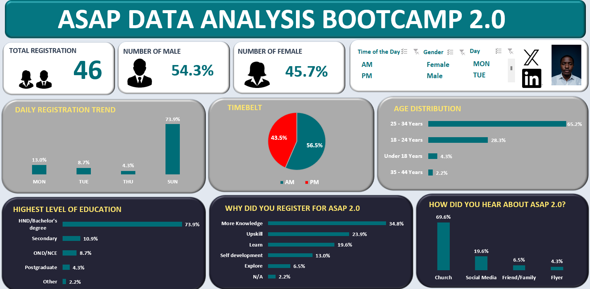

# ASAP_2.0_Bootcamp_analysis
## Adullam Skill Acquisition Program – Survey Analysis

📊 **Project Overview**

This project analyzes survey responses collected from participants interested in the Adullam Skill Acquisition Program. The goal is to understand the demographics, educational background, motivations, and engagement level of applicants in order to support better planning, communication, and program delivery.

The analysis was carried out using Microsoft Excel, including data cleaning, pivot analysis, and dashboard creation.

---

## 🎯 Objectives

- Understand the gender and age distribution of applicants  
- Analyze educational background of participants  
- Identify motivations for joining the program  
- Evaluate awareness channels (how participants heard about the program)  
- Assess commitment level and prior participation (Adullam 1.0)  
- Track registration trends by day and time  

---

## 🗂 Dataset Description

The dataset contains the following key fields:

- **Timestamp** – Date and time of registration  
- **Gender** – Male / Female  
- **Age Range** – 18–24, 25–34, 35–44, etc.  
- **Highest Level of Education** – Secondary, OND/NCE, HND/Bachelor’s, Postgraduate, etc.  
- **Reason for Joining** – Why the applicant wants to join the program  
- **Previous Attendance** – Whether the applicant attended Adullam 1.0  
- **Payment Awareness** – Understanding of payment requirements  
- **Source of Information** – How the applicant heard about the program  
- **Commitment Agreement** – Willingness to actively participate  

---

## 🧹 Data Cleaning & Preparation

All cleaning and transformations were done in the **WORKING DATA** sheet, including:

- Standardizing category names (e.g., education levels, gender)  
- Removing inconsistencies and blanks  
- Preparing fields for pivot analysis and dashboard visuals  

---

## 📈 Analysis Performed

Using pivot tables and calculations, the following analyses were carried out:

1. **Gender Distribution** – Comparison of male vs female applicants  
2. **Age Range Analysis** – Identifying the most common age groups among applicants  
3. **Educational Background** – Distribution of applicants by highest level of education  
4. **Daily Registration Trend** – Tracking which days of the week had the highest registrations (e.g., Monday, Tuesday, Sunday)  
5. **Time of Registration (AM vs PM)** – Understanding when most people register  
6. **Awareness Channel Analysis** – Evaluating how participants heard about the program (e.g., social media, referrals)  
7. **Motivation Analysis** – Understanding why applicants want to join the program  

---

## 📊 Dashboard

The **DASHBOARD** sheet contains visual representations of:

- Gender distribution  
- Daily registration trend  
- Education level distribution  
- Time of registration (AM/PM)  
- Key summary metrics for quick insight  

This dashboard is designed to give stakeholders a quick, visual understanding of applicant patterns and behaviour.

---

## 🛠 Tools Used

- Microsoft Excel  
- Data cleaning  
- Pivot tables  
- Charts & dashboard design  

---

## 📌 Key Insights (High Level)

- Majority of applicants fall within the young adult age range (18–34)  
- A significant number hold HND/Bachelor’s degrees, indicating a relatively educated audience  
- Most registrations occur on specific high-traffic days (e.g., Sunday)  
- Social channels play a major role in program awareness  
- High willingness to commit time and participate actively  

---

## 🚀 How to Use This Project

1. Open the Excel file  
2. Review **DATA** sheet for raw entries  
3. Check **WORKING DATA** for cleaned dataset  
4. Explore **ANALYSIS** sheet for pivot insights  
5. View **DASHBOARD** for visual summary  

---

## 👤 Author

**Onifade Oluwagbemiga**  
Data Analysis Project – Adullam Skill Acquisition Program
